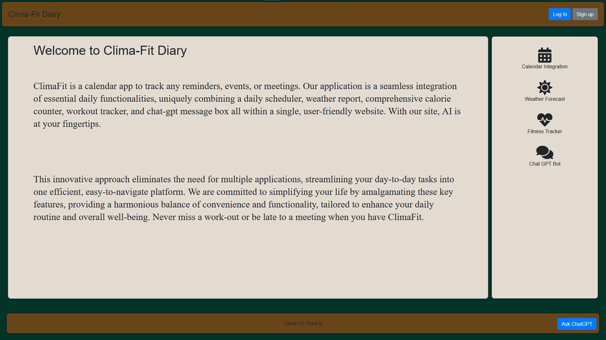

# ClimaFit-Diary

## About

ClimaFit is a fitness app that uniquely combines weather report, comprehensive calorie counter, and workout tracker, with the addiiton of OpenAI message box all within a single, user-friendly website. With our site, AI is at your fingertips. This innovative approach eliminates the need for multiple applications, streamlining your day-to-day tasks into one efficient, easy-to-navigate platform. We are committed to simplifying your life by amalgamating these key features, providing a harmonious balance of convenience and functionality, tailored to enhance your daily routine and overall well-being.Never miss a work-out or be late to a meeting when you have ClimaFit.

## User Story

AS An average person that goes to the gym.

I WANT to keep track of schedule, my work-outs, and my diet.

SO THAT I can better take care of myself, my mental health, and keep my time management on track.

## Dependencies

- Day.js
- Express
- Node MySQL2
- Sequelize
- Handlebars.js
- Express-session
- Dotenv

## Usage

You can go to https://climafit-diary2-892fe0b66cb5.herokuapp.com/ to sign up and create your own calendar today.

## CSS

We are using Bootstrap for the css framework.

## APIS

- OPENAI
- OpenWeatherMaps
- CalorieNinjas

## Labor

Project board: https://github.com/users/ajabadi/projects/6

Jose: Calorie, Fitness tracker component, Login and Signup (Front-end and Backend)

Sven: Weather component (Front-end and Backend)

Alec: CSS and Presentation component

Lovepreet: ChatGPT component
